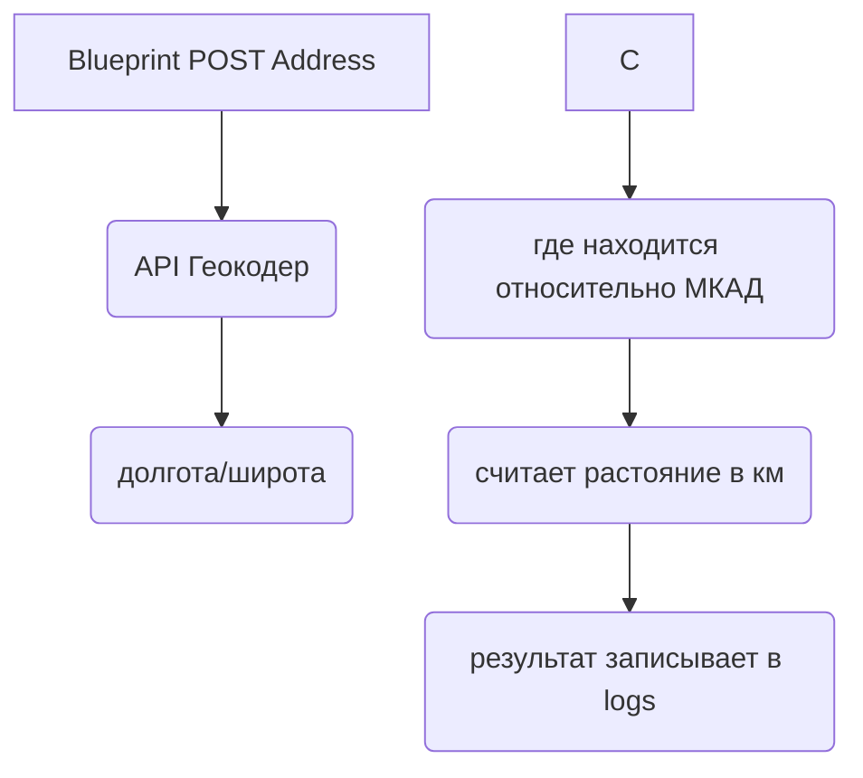

## Flask_Project

---

### Модуль Flask Blueprint - расчитывает растояние от указанной точки на карте до МКАД по прямой использую формулу haversine.  
Принцип работы: blueprint получает адрес (строкой). Делается http запрос к сервису API Геокодер. Полученые координаты проверяются на нахождение относительно МКАД, если адрес находится за пределами МКАД, расчитывается растояние по прямой линии относительно поверхности земли от адреса до ближайшей точки на окружности МКАДа в км. Результат записывается в лог файл. Если адрес в пределах МКАД то в лог файл записывается то, что адрес находится в пределах МКАД.

#### Подключение blueprint "address"

Создайте файлы папку в вашем проекте

```bash
# Папка для Blueprint
mkdir ./bluprints/address
# файл .env
touch .env 
# Загрузите зависимости
pip install -r requirements.txt   
```
поместите в файл `.env` `apikey` [инструкция здесь](https://yandex.ru/dev/maps/geocoder/doc/desc/concepts/about.html)  Пример `.env.exsample`   
Слонируйте blueprint "address" в папку "address"

```bash
git clone https://github.com/gusevskiy/Flask_Project.git
```

Подключите blueprint "address" в вашем приложении

```bash
# app.py
from blueprints.address.address import address

app.register_blueprint(address, url_prefix="/post_address")
```

После запуска приложения `flask run` blueprint `address` будет доступен по `http`

```bash
# Пример curl запроса
curl --request POST --header "Content-Type: application/json" --data '{"address": "your_address"}' http://"your_host":"your_port"/address/post_address
```
#### Стек технологий
python 3.8  
API Геокодер





#### Используемые резурсы

[API Геокодера YAndex](https://yandex.ru/dev/geocode/doc/ru/request)  
[Примеры от яндекс на JS](https://yandex.ru/dev/maps/jsbox/2.1/multiroute_data_access)  
[Yandex карты кабинет разработчика](https://yandex.ru/maps-api/products/?from=club)  
[Flask](https://flask.palletsprojects.com/en/2.0.x/)  
[Для тестов получить адрес точки на карте с координатами](https://snipp.ru/tools/address-coord)
