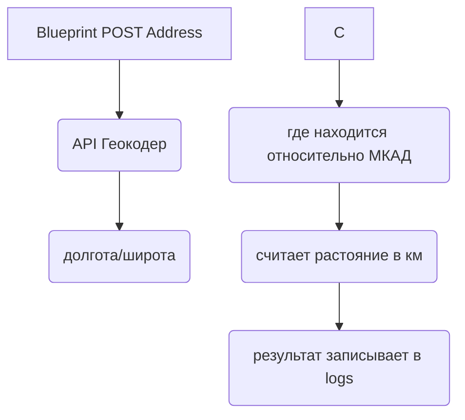

## Flask_Project

---

### Модуль Flask Blueprint - расчитывает растояние от указанной точки на карте до МКАД по прямой использую формулу [haversine](https://en.wikipedia.org/wiki/Haversine_formula).

Принцип работы: blueprint.address получает адрес (строкой). Делается http запрос к сервису API Геокодер. Полученые координаты проверяются на нахождение относительно МКАД, если адрес находится за пределами МКАД, расчитывается растояние по прямой линии относительно поверхности земли от адреса до ближайшей точки на окружности МКАДа в км. Результат записывается в лог файл. Если адрес в пределах МКАД то в лог файл записывается то, что адрес находится в пределах МКАД.  


[Подключение blueprint "address"](#Подключение-blueprint-"address")  
[Тестирование](#Тестирование)  
[Стек технологий](#Стек-технологий)  
[Схема](#Схема)  
[Дополнительные решения.](#Дополнительные-решения.)  
[Используемые резурсы](#Используемые-резурсы)


#### Подключение blueprint "address"

Создайте файлы папку в вашем проекте

```bash
# Папка для Blueprint
mkdir ./bluprints/address
# файл .env
touch .env
# Загрузите зависимости
pip install -r requirements.txt
```

поместите в файл `.env` `apikey` [инструкция здесь](https://yandex.ru/dev/maps/geocoder/doc/desc/concepts/about.html) Пример `.env.exsample`  
Слонируйте blueprint "address" в папку "address"

```bash
git clone https://github.com/gusevskiy/Flask_Project.git
```

Подключите blueprint "address" в вашем приложении

```bash
# app.py
from blueprints.address.address import address

app.register_blueprint(address, url_prefix="/post_address")
```

После запуска приложения `flask run` blueprint `address` будет доступен по `http`

```bash
# Пример curl запроса
curl --request POST --header "Content-Type: text/plain; charset=utf-8" --data "your_address" http://"your_host":"your_port"/address/post_address
```

#### Тестирование

```bash
# Запуск тестов
python -m unittest -v test_blueprint/test_blueprint.py
```

#### Стек технологий

python 3.8  
API Геокодер

#### Схема

#### Дополнительные решения.
1) Изменение метода расчета растояния от МКАД до адреса. Для определения растояния по пути следования, например авто дороге. Можно подключить матрицу растояний от [API Яндекс Карты](https://yandex.ru/maps-api/products/distancematrix-api)
2) В зависимости от задачи можно ограничить область для расчета растояния. Нипример только московской областью или задать принудительные точки координат за приделами которых поиск не осуществляется.  
3) Проработать работу с JSON файлом. В нем возращается от API Геокодера гораздо больше информации.


#### Используемые резурсы

[API Геокодера Yandex](https://yandex.ru/dev/geocode/doc/ru/request)  
[Примеры от яндекс на JS](https://yandex.ru/dev/maps/jsbox/2.1/multiroute_data_access)  
[Yandex карты кабинет разработчика](https://yandex.ru/maps-api/products/?from=club)  
[Flask](https://flask.palletsprojects.com/en/2.0.x/)  
[Для тестов получить адрес точки на карте с координатами](https://snipp.ru/tools/address-coord)  # координаты поменять местами при вводе в коде.  
[Unittests](https://docs.python.org/3/library/unittest.html)
